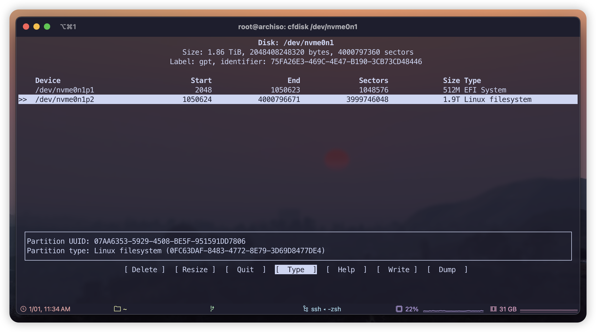

## Disable reflector service
```
systemctl stop reflector.service
```

## Verify that it is in UEFI mode
```
ls /sys/firmware/efi/efivars
```

## Connect to a network
```
iwctl
device list 
station wlan0 scan
station wlan0 get-networks
station wlan0 connect wifi-name
exit
```

## Updating the system clock
```
timedatectl set-ntp true
timedatectl status 
```

## Partitioning and formatting (using the Btrfs file system)

### Format drive
```
wipefs --all /dev/nvme0n1
```
### Partitioning
```
cfdisk /dev/nvme0n1
```
<p align="center">
  
</p>

### Create encryption
```
cryptsetup --cipher aes-xts-plain64 --hash sha512 --use-random --verify-passphrase luksFormat /dev/nvme0n1p2
```
### Open partition
```
cryptsetup luksOpen /dev/nvme0n1p2 root
```
### Format paritions
```
mkfs.fat -F32 /dev/nvme0n1p1
mkfs.btrfs /dev/mapper/root
```
### Create sub-volumes
```
mount /dev/mapper/root /mnt
cd /mnt
btrfs subvolume create @
btrfs subvolume create @home
cd
umount /mnt
mount -o noatime,space_cache=v2,compress=zstd,ssd,discard=async,subvol=@ /dev/mapper/root /mnt
mkdir /mnt/{boot,home}
mount -o noatime,space_cache=v2,compress=zstd,ssd,discard=async,subvol=@home /dev/mapper/root /mnt/home/
mount /dev/nvme0n1p1 /mnt/boot
```
## Install base system
```
pacstrap /mnt base base-devel linux linux-firmware btrfs-progs
pacstrap /mnt networkmanager openssh vim sudo zsh zsh-completions git wget
```
## Generate fstab
```
genfstab -U /mnt >> /mnt/etc/fstab
```
## Change root
```
arch-chroot /mnt
```